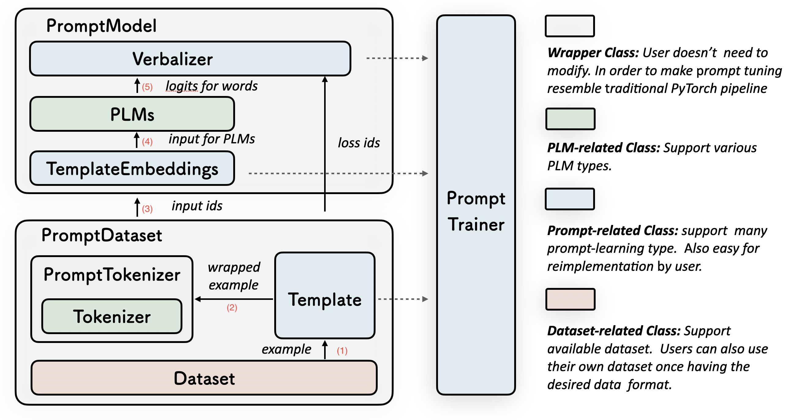

# OpenPrompt Pipeline



## CLI Process

### Get Config
```python
config, args = get_config()
```

### sss


##  PromptDataLoader
PromptDataLoader wraps the orginal dataset. The input data is firstly wrapped with the prompt's template, and then is tokenized by a wrapperd-tokenizer. 
(0) data process

针对不同的数据集，在load_data时进行不同的处理，最后形成统一格式的数据


(1) wrapped with the prompt's template，**对应（1）**


(2) tokenized by a wrappered-tokenizer，**对应（2）**

## 